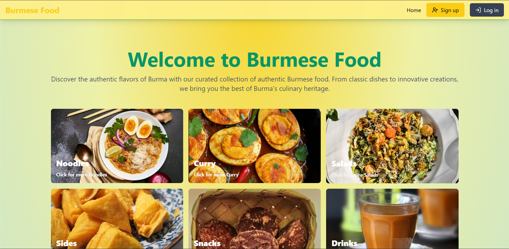

# Burmese Food

A full-stack e-commerce platform for ordering authentic Burmese cuisine. The website allows users to browse, purchase, 
and manage food orders while providing an admin panel for managing products, orders, and customers.  
The website is accessible at [Burmese-Food-Ecommerce](https://burmese-food.onrender.com/)



## 🌟 Features  

- 🛒 **E-Commerce Core** – Product & category management  
- 🔑 **Authentication** – User signup/login with JWT (Access & Refresh Tokens)  
- 💳 **Payments** – Secure Stripe checkout integration  
- 🎟️ **Coupon System** – Apply discount codes at checkout  
- 📦 **Shopping Cart** – Persistent cart for users
- ⭐ **Featured Products** – Highlighted items selected by admins for promotion
- 📊 **Admin Dashboard** – Order tracking, analytics, and management  
- ⚡ **Caching & Performance** – Redis integration for fast response times  
- 🔐 **Security** – Data protection measures for user information  

## 🚀 Technologies Used  

### Backend  
- **Node.js**, **Express.js** – Server-side API  
- **MongoDB** – Database for storing products, users, and orders  
- **Redis** – Caching for faster data retrieval  
- **JWT Authentication** – Secure user sessions  
- **Stripe API** – Payment processing  

### Frontend  
- **React.js** – User interface  
- **Tailwind CSS** – Styling  
- **React Query** – API data fetching and caching  

## 📥 Installation & Setup  

### 1️⃣ Clone the repository  
```bash
git clone https://github.com/AungPyaeSone1000/Ecommerce.git
cd Ecommerce
```

### 2️⃣ Install dependencies  
```bash
npm install
```

### 3️⃣ Configure environment variables  
Create a `.env` file and add your database and API keys:  
```env
MONGO_URI=your_mongodb_connection
REDIS_URL=your_redis_url
JWT_SECRET=your_secret_key
STRIPE_SECRET_KEY=your_stripe_key
```

### 4️⃣ Run the development server  
```bash
npm run dev
```
The server should now be running on **http://localhost:5000** (or your configured port).  

## 🎯 Roadmap / Future Enhancements  
- 📱 Mobile-friendly UI improvements  
- 📦 Advanced order tracking for customers  
- 🌍 Multi-language support  

## 📝 License  
This project is not licensed but please don't use it for profit.

---

